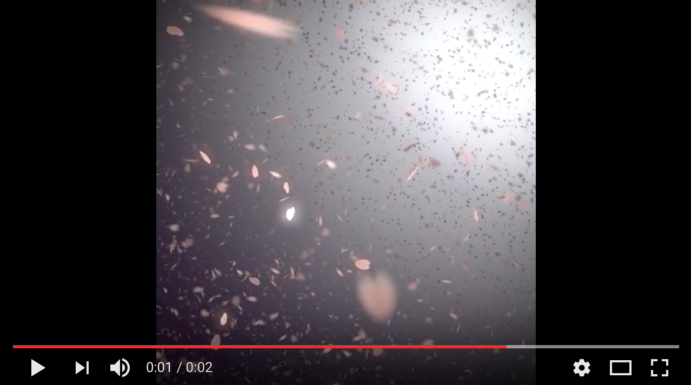

# SaveFrame

[](https://badge.fury.io/js/saveframe)


### Install

	npm install saveframe


### Run the server

The server is a Node.js script, you can run it with:

	node node_modules/saveframe/server.js <foldername>

where <foldername> is the folder where to put the png files (must be available)


### Configure the client

Include the required libraries and use the proper method to interact with the server.

Here a quick sample:

```html
<html>
	<head>
		<script src="node_modules/socket.io-client/dist/socket.io.js"></script>
		<script src="node_modules/saveframe/client.js"></script>
	</head>

	<body>
		<canvas></canvas>

		<script type="text/javascript">
			var canvas = document.querySelector('canvas')
			
			// specify the canvas you want to render to disk
			SaveFrame.init(canvas)

			// draw something on your canvas
			var ctx = canvas.getContext('2d')
			ctx.fillStyle = '#f00'
			ctx.fillRect(20, 20, 100, 100)
			
			// save the frame to disk (into 'tmp/frame-0.png')
			SaveFrame.save()
		</script>
	</body>
</html>

```

The PNG size will match the canvas size.
You can then create a video using the image sequence, Quicktime of other similar tools do this job.


### Run the client

To run the client file with the browser use a local webserver of your choice (http-server, browser-sync, python SimpleHTTPServer, whatever...).


---

You can watch e quick test here with a [WelGL canvas](https://codepen.io/abusedmedia/pen/rwWjgp):

[](https://www.youtube.com/watch?v=PON3_FdU1Kk)

